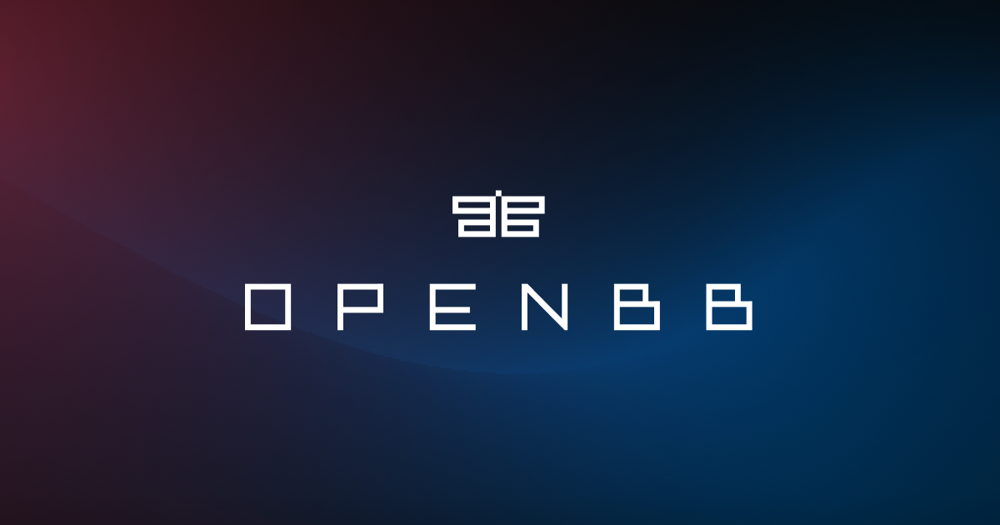

<!-- PROJECT LOGO -->
 

  

  <h3 align="center">OpenBB Terminal 🚀</h3>
  
Click on the GIF below for a DEMO of the terminal.

   

  

    Investment research for everyone.
     
    <a href="https://github.com/Cryptocurrency-TOOLS/OpenBBTerminal/tree/master/openbb_terminal/README.md"><strong>≪  GETTING STARTED</strong></a>
    &nbsp · &nbsp <a href="https://github.com/Cryptocurrency-TOOLS/OpenBBTerminal/tree/master/CONTRIBUTING.md"><strong>CONTRIBUTING</strong></a> &nbsp · &nbsp
    <a href="https://github.com/Cryptocurrency-TOOLS/OpenBBTerminal/">
    <strong>SEE FEATURES »</strong></a>
     
    
<!-- TABLE OF CONTENTS -->

  
<h2 style="display: inline-block">Table of Contents</h2>

  <ol>
    <li> <a href="#about-the-project">About The Project</a> </li>
    <li><a href="#installation">Installation</a></li>
    <li><a href="#contributing">Contributing</a></li>
    <li><a href="#license">License</a></li>
    <li><a href="#disclaimer">Disclaimer</a></li>
   </ol> 
  

## About The Project

**How it started:**

OpenBB Terminal is an awesome stock and crypto market terminal that has been developed for fun, while I saw my GME
shares tanking. But hey, I like the stock 💎🙌.

**How it's going:**

OpenBB Terminal provides a modern Python-based integrated environment for investment research, that allows
an average joe retail trader to leverage state-of-the-art Data Science and Machine Learning technologies.

As a modern Python-based environment, OpenBBTerminal opens access to numerous Python data libraries in Data Science
(Pandas, Numpy, Scipy, Jupyter), Machine Learning (Pytorch, Tensorflow, Sklearn, Flair), and Data Acquisition
(Beautiful Soup, and numerous third-party APIs).

## Installation

If you wish to install the Terminal, there are currently four options:

- [Using the Installer](https://github.com/Cryptocurrency-TOOLS/OpenBBTerminal/#accessing-the-openbb-terminal) (recommended if you just want to use the terminal)
- [Using Python](openbb_terminal/README.md#anaconda--python) (recommended if you want to develop new features)
- [Using Docker](openbb_terminal/README.md#Docker-Installation) (alternative option to the installer if preferred)
- [Using Docker Web UI](openbb_terminal/README.md#web-ui---docker) (if you want to deploy the web UI for users to access
  over your LAN)

## Contributing

There are 3 main ways of contributing to this project. (Hopefully you have starred the project by now ⭐️)

**Become a Contributor**

1. Fork the Project
2. Create your Feature Branch (`git checkout -b feature/AmazingFeature`)
3. Install the pre-commit hooks by running: `pre-commit install`
      Any time you commit a change, linters will be run automatically. On changes, you will have to re-commit
4. Commit your Changes (`git commit -m 'Add some AmazingFeature'`)
5. Push to your Branch (`git push origin feature/AmazingFeature`)
6. Open a Pull Request

You can read more details about adding a feature in our [CONTRIBUTING GUIDELINES](/CONTRIBUTING.md).

**Raise an issue or Request a feature**

- Raise an issue by opening a [bug ticket](https://github.com/Cryptocurrency-TOOLS/OpenBBTerminal/issues).
- Request a new  feature through a [feature request ticket](https://github.com/Cryptocurrency-TOOLS/OpenBBTerminal/issues).

## License

Distributed under the MIT License. See
[LICENSE](https://github.com/Cryptocurrency-TOOLS/OpenBBTerminal/blob/main/LICENSE) for more information.

## Disclaimer

"A few things I am not. I am not a cat. I am not an institutional investor, nor am I a hedge fund. I do not have
clients and I do not provide personalized investment advice for fees or commissions." DFV

Trading in financial instruments involves high risks including the risk of losing some, or all, of your investment
amount, and may not be suitable for all investors. Before deciding to trade in a financial instrument you should be fully
informed of the risks and costs associated with trading the financial markets, carefully consider your investment
objectives, level of experience, and risk appetite, and seek professional advice where needed. The data contained in the OpenBB terminal
is not necessarily accurate. OpenBB and any provider of the data contained in this website will not accept liability for
any loss or damage as a result of your trading, or your reliance on the information displayed.

## Star History

